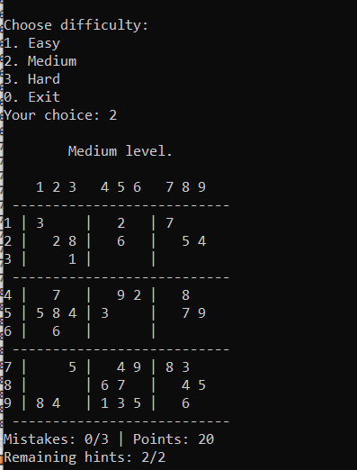

  

  

# 🧩 Sudoku Game
## What is Sudoku?

Sudoku is a logic-based number puzzle. The player's goal is to fill a 9x9 grid with numbers from 1 to 9 so that:  
- Each row  
- Each column  
- And each of the nine 3x3 subgrids  

contain all the numbers from 1 to 9 without any repetition.

---

## 🧩 Console Sudoku Game (C++)

This is a **console-based Sudoku game implemented in C++**.  
It offers a user-friendly experience with difficulty levels, a scoring system, and limited hint/auto-fill options to make the game more strategic and engaging.

---

## ✨ Features Included

The Sudoku application includes the following features:

### 🧠 Three Difficulty Levels
Choose between **Easy, Medium**, and **Hard**, with 10, 20, and 30 pre-filled numbers respectively.

### ⭐ Points System
- Earn **+2 points** for every correct number you place.  
- Lose **-2 points** for each mistake.

### 💡 Hint System
- You can request **only one hint** per game.  
- A hint reveals a correct number and its position.

### ⚙️ Auto-Fill Option
- You can use **only one auto-fill** per game.  
- It automatically fills in one correct number.

### ♻️ Retry Mechanism
- If you make **3 mistakes**, you have the option to buy **3 more chances** by spending **5 points**.
  
### ⏱️ Timer
- A **timer** tracks how long it takes you to complete the puzzle.  
- Your **total time is displayed at the end** of the game.
  
### 🧩 Random Puzzle Generator
- The game generates a complete and valid Sudoku solution.  
- Then it removes numbers based on the selected difficulty level.

### 🎮 Interactive Console Gameplay
Play directly from the console by typing your inputs:

- Enter: `row column number` to fill a cell (e.g., `3 4 5`)
- Type `'h'` to request a hint.
- Type `'a'` to use the auto-fill option.
- Type `'0 0 0'` to exit the game.

---

These features combine the logical essence of Sudoku with strategic elements like point management and limited help options — making the game more engaging and challenging for the player.

---
## 📸 Screenshots

### 🧠 Medium Difficulty

  

